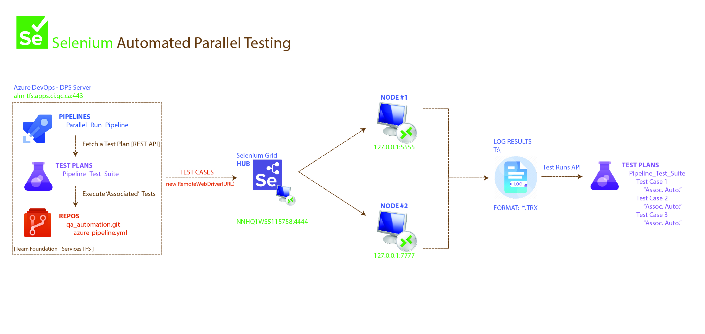

# Selenium C# webdriver API

## 1. INSTALL 


### 1.1 INSTALL .NET SDK
```bash
> https://dotnet.microsoft.com/en-us/download       # DOWNLOAD & INSTALL .NET 8.0 (or 9.0...etc)
> dotnet --version                                  # 8.0.410
> dotnet --info                                     # Detailed : .NET SDK (v8.0) ; Runtime (Mac OS X) ; .NET runtimes..etc
```

<details closed>
<summary>.NET CLI TOOLS</summary>

```bash
# [0] Find .NET CLI Tool
> dotnet tool list --global
> dotnet tool search <Tool>

# [1] Install .NET CLI Tool
> dotnet tool install --global <Tool>           # install in '~/.dotnet/tools/dotnet-script' ; set $PATH in ~/.zprofile
> dotnet tool uninstall --global <Tool>         

# [2] Use installed .NET CLI Tools
> dotnet-script <myScript>.cs
> dotnet ildasm <MyApp.dll> -o <MyApp>.il       # or takes *.dll or *.exe ; generates MSIL language *.il 
> dotnet-trace collect -p <PID> --duration 00:00:10 --format speedscope
> dotnet-symbol --symbols --modules --debugging <dump-file-path>

# [3] Create .NET CLI Tool
> dotnet new tool-manifest
> dotnet tool install dotnetsay
> dotnet tool restore

> dotnet new console -n HelloWorldCli
> cd HelloWorldCli
> vim HelloWorldCli.csproj
<PropertyGroup>
  <OutputType>Exe</OutputType>
  <TargetFramework>net6.0</TargetFramework>
  <PackAsTool>true</PackAsTool>
  <ToolCommandName>helloworld</ToolCommandName>
  <PackageOutputPath>./nupkg</PackageOutputPath>
</PropertyGroup>

> dotnet pack
> dotnet tool install --global --add-source ./nupkg HelloWorldCli
> helloworld
```
</details>

### 1.2 Base Class Library (BCL) & .NET runtime

> REFERENCE: https://learn.microsoft.com/en-us/dotnet/api/

```bash
> dotnet --list-runtimes                        # Microsoft.NETCore.App 8.0.16 & 6.0.36
```

<details closed>
<summary>.NET RUNTIME</summary>

```bash
    Microsoft.NETCore.App 8.0.16    [/usr/local/share/dotnet/shared/Microsoft.NETCore.App]

        System.Private.CoreLib.dll                # Use Intermediate Language Disassembler [ILDASM] tool to view  
        System.Runtime.dll                        # > ildasm MyApp.exe /output:MyApp.il
        System.Console.dll                        # > ilasm MyApp.il
        System.Collections.dll
        System.Linq.dll
        System.Net.Http.dll
        ...
            > using System;                         # Basic .NET types
            > using System.Console;                 # Console.WriteLine("Hello World !!!");
            > using System.Threading;               # For thread sleep or delays (not recommended for waits)
            > using System.Collections.Generic;
            > using System.IO;
            > using System.Threading;
            > using System.Net;
            ...

    Microsoft.AspNetCore.App 8.0.16 [/usr/local/share/dotnet/shared/Microsoft.AspNetCore.App]

        Microsoft.AspNetCore.Mvc.Core.dll
        Microsoft.AspNetCore.Http.dll
        Microsoft.AspNetCore.Routing.dll
        Microsoft.Extensions.Logging.dll
        ...
            > using Microsoft.AspNetCore
            > using Microsoft.AspNetCore.Mvc
            > using Microsoft.AspNetCore.Http
            > using Microsoft.AspNetCore.Builder
            > using Microsoft.Extensions.DependencyInjection
            ...
```
</details>

## 2. TEMPLATES [ SOLUTION > PROJECTS ]

### 2.1 CREATE PROJECT

```bash
> dotnet new list                               # list Templates : < sln | console| nunit | classlib > 
> dotnet new sln -n <MySolution>

> dotnet new classlib -n <MyClassLibProj>
> dotnet sln <MySolution.sln> add <MyClassLibProj.csproj>

> dotnet new console -n <MyConsoleProj>
> dotnet sln <MySolution.sln> add <MyConsoleProj.csproj>

> dotnet sln <MySolution.sln> list

> dotnet sln <MySolution.sln> remove <ProjToRemove.csproj>

/MySolution
│
├── MySolution.sln                 # Solution file
│
├── /MyApp                         # Class library project
│   ├── MyApp.csproj
│   └── Calculator.cs              # Example class
│
├── /MyApp.Tests                   # NUnit test project
│   ├── MyApp.Tests.csproj
│   ├── CalculatorTests.cs         # NUnit test class
│   └── TestHelpers.cs             # Optional: shared test utilities

> dotnet new gitignore
> dotnet pack	                     # Create NuGet Package 'MySolution'
```

<details closed>
<summary>MySolution.sln [ *.sln ]</summary>

```
Microsoft Visual Studio Solution File, Format Version 12.00
# Visual Studio Version 17
VisualStudioVersion = 17.0.31903.59
MinimumVisualStudioVersion = 10.0.40219.1

Project("{GUID}") = "MyApp", "MyApp\MyApp.csproj", "{ProjectGUID}"
EndProject

Global
    GlobalSection(SolutionConfigurationPlatforms) = preSolution
            Debug|Any CPU = Debug|Any CPU
            Release|Any CPU = Release|Any CPU
    EndGlobalSection

    GlobalSection(SolutionProperties) = preSolution
            HideSolutionNode = FALSE
    EndGlobalSection
EndGlobal
```
</details>

<details closed>
<summary>MyApp.csproj [ *.csproj ]</summary>

```xml
<Project Sdk="Microsoft.NET.Sdk">

  <PropertyGroup>
    <TargetFramework>net8.0</TargetFramework>                           <!-- .NET SDK v8.0 -->
    <ImplicitUsings>enable</ImplicitUsings>                             <!-- -->
    <Nullable>enable</Nullable>                                         <!-- -->
    <OutputType>Exe</OutputType>                                        <!-- build generates *.exe -->
    <AssemblyName>???</AssemblyName>                                    <!-- *.dll assembly name ? -->
  </PropertyGroup>

  <ItemGroup>
    <ProjectReference Include="..\MyLibrary\MyLibrary.csproj" />        <!-- Internal Reference Library -->
    <PackageReference Include="Newtonsoft.Json" Version="13.0.1" />     <!-- -->
  </ItemGroup>

</Project>
```
</details>


### 2.2 External Packages & Internal References > C# Namespaces

**> [NuGet repository ](https://www.nuget.org/)**

<details closed>
<summary>PACKAGE[ NAMESPACE ]</summary>

```bash
# TODOOOOO
> dotnet restore                                # Restores NuGet packages and dependencies

# [1] Add Internal Reference Library
> dotnet list reference
> dotnet add reference <MyLibrary.csproj> --project <MyApp.csproj>
> dotnet remove reference <MyLibrary.csproj> --project <MyApp.csproj>

# [2] Add External Package NuGet Library
> dotnet list package                           # packages installed in current project

> dotnet search <package-name>                  # search a NuGet package
> dotnet search Selenium

> dotnet add package < package-name >           # install NuGet package
    > using < Package.NameSpace >               # namespace to import (using) the package in C# scripts

> dotnet add package Selenium.WebDriver         # NuGet Package
    > using OpenQA.Selenium.Chrome;             # Selenium WebDriver core : IWebDriver, By, IWebElement...etc

> dotnet add package NUnit
    > using NUnit.Framework;                    # NUnit core attributes and assertions

# [3] Remove Internal/External Library
> dotnet remove package <package-name>
    > using < Package.NameSpace >               # namespace to import (using) the package in C# scripts

> dotnet remove package Selenium.Support        # remove library files & reference in *.csproj
    > using OpenQA.Selenium.Support.UI;         # WebDriver support classes (e.g.: WebDriverWait, SelectElement)
```
</details>

## 3. IMPLEMENT 

> REFERENCE: https://www.geeksforgeeks.org/c-sharp/automation-using-selenium-in-c-sharp-with-example/

### 3.1 NAMESPACE

```CS
// [0] Project Namespace to reference

using MyApp.GUI;                // namespace MyApp.GUI;			    # var one = MyApp.GUI.MyClass();
using MyApp.DB;                 // namespace MyApp.DB;			    # var two = MyApp.DB.MyClass();
using MyApp.Logging;            // namespace MyApp.Logging;	   	    # var three = MyApp.Logging.MyClass();

// [0] Import (using) package by namespace

using System;                   // .Collections.Generic [Dictionary<TKey, TValue>]  .Linq .Threading
using NUnit.Framework;
using OpenQA.Selenium;          // .Chrome .Interactions .Support.UI 

// [1] Give unique Namespace to project
namespace HelloWorld;
```
### 3.2 CLASS
```CS
// [2] Define a Class Object Type
public class Tests
{
    // [2] Declate Class Variables
    private String firstname;
    private String lastname;
```

<details closed>
<summary>NUnit FRAMEWORK TEST ATTRIBUTES</summary>

> REFERENCE : https://docs.nunit.org/articles/nunit/getting-started/installation.html

```bash
# NUnit : entry point is identified by the 'NUnit Test Runner' using attributes NOT by a 'main()' method
# NUnit Test ATTRIBUTES
[SetUpFixture]			# marks a (global) CLASS to define setup/teardown for entire NAMESPACE or ASSEMBLY
	[TestFixture]			# <--- marks a CLASS that contains NUnit tests
		[OneTimeSetUp]			# marks a METHOD to run ONCE BEFORE any tests in the fixture. For expensive setup.
			(Constructor)           # create the CLASS object/instance
			[SetUp]					# marks a METHOD to run BEFORE each test. To initialize the test context.	
				[Test]					# <--- marks a METHOD to be run by the test runner
				[TestCase]				# <--- marks a METHOD for multiple runs using different sets of inputs/parameters.
			[TearDown]				# marks a METHOD to run AFTER each test. To clean up resources.
		[OneTimeTearDown]		# marks a METHOD to run ONCE AFTER any tests in the fixture. For expensive cleanup.

                [Ignore]				# skip a test of test fixture. Can include a reason.
                [Category]				# GROUP tests under a category for filtering.
                [Obsolete]				# marks code as obsolete - compiler shows warning
                [Serializable]			# 
                [NonSerialized]	
```
</details>

### 3.3 NUnit[SetUp] > WebDriver
```CS
    // [2a] NUnit Setup prior to running a Test

    [SetUp]                 // marks a METHOD to run BEFORE each test. To initialize the test context.
    public void Setup()
    {
        // [2a][1] webdriver [ IWebDriver vs. RemoteWebDriver vs. ChromeWebdriver ]

        var options = new ChromeOptions();
        options.AddArgument("start-maximized");     // ex.: --disable-gpu --no-sandbox --headless
        
        driver = new ChromeDriver(options);         // localhost WebDriver
        wait = new WebDriverWait(driver, TimeSpan.FromSeconds(10));

        driver = new RemoteWebDriver(               // Remote WebDriver - Selenium Grid
            new Uri("http://localhost:4444/wd/hub"),
            options.ToCapabilities(),
            TimeSpan.FromSeconds(60));
    }
```
### 3.4 NUnit[Test] > [ Navigate | DOM Locators | actions(click, fill) | checks ]
```CS
    // [2b] NUnit Test Case
    
    [Test]                  // <--- marks a METHOD to be run by the test runner
    [TestCase]				// <--- marks a METHOD for multiple runs using different sets of inputs/parameters.
    public void Test_1_()
    {
        Console.WriteLine("running [Test]...");


        /* [01] Navigate to a site :
        *
        * driver.Url = "https://the-internet.herokuapp.com/";
        * driver.Navigate().GoToUrl("https://the-internet.herokuapp.com/");
        * driver.Navigate().Refresh();
        *
        */
        driver.Navigate().GoToUrl("https://the-internet.herokuapp.com/");
        Thread.Sleep(3000); // Wait for the page to load


        /* [02] Find Elements :
        *
        * By.Id("username");
        * By.Name("password");
        * By.ClassName("example");
        * By.TagName("h2");
        * By.LinkText("Form Authentication");
        * By.PartialLinkText("Form");
        * By.CssSelector("h2");
        *
        * By.XPath("//h2[text()='Welcome to the-internet']");
        *
        */
        IWebElement formLink = driver.FindElement(By.LinkText("Form Authentication"));
        //IWebElement button = driver.FindElement(By.XPath("//form[@id='login']"));
        Thread.Sleep(3000);
        


        // 2.6 checks [ Assert. ]

        // iframes ; 
        // logging info for each

        Assert.Pass();
    }
```
### 3.5 NUnit[TearDown] > [ webdriver.quit | webdriver.dispose ]
```CS
    // [2c] NUnit TearDown after Test Case

    [TearDown]
    public void TearDown()
    {
        driver?.Quit();
        driver?.Dispose();
    }
}
```

## 4. RUN

```bash
# Clean, and build the project
> dotnet clean
> dotnet restore
> dotnet build
> dotnet run                           # does not work for NUnit projects ; no main()
> dotnet run --project MyApp
```
## 5. Configure myTest.runsettings
```xml
<?xml version="1.0" encoding="utf-8"?>
<RunSettings>

  <RunConfiguration>
    <TargetFrameworkVersion>net6.0</TargetFrameworkVersion>
    <ResultsDirectory>TestResults</ResultsDirectory>
  </RunConfiguration>

  <DataCollectionRunSettings>
    <DataCollectors>
      <DataCollector friendlyName="Code Coverage" />
    </DataCollectors>
  </DataCollectionRunSettings>

  <TestRunParameters>
    <Parameter name="outputDirectory" value="/Users/adnane/Desktop" />
    
    <Parameter name="herokuapp-password" value="SuperSecretPassword!" /> 
    <!-- C# code: string password = TestContext.Parameters["herokuapp-password"]; -->

    <Parameter name="herokuapp-username" value="tomsmith" /> 
    <!-- C# code: string username = TestContext.Parameters["herokuapp-username"]; -->
  </TestRunParameters>

</RunSettings>
```

```CS
[Test]
public void test_credentials(){

  string username = TestContext.Parameters["herokuapp-username"];
  string password = TestContext.Parameters["herokuapp-password"];

  driver.Navigate().GoToUrl("https://the-internet.herokuapp.com/login")

  driver.FindElement(By.Id("username")).SendKeys(username);
  driver.FindElement(By.Id("password")).SendKeys(password);

  Thread.Timeout(50000);

  driver.FindElement(By.Type("submit")).Click();
}
```


```bash
# list available test
> dotnet test -t                        # VisitGoogle, VisitMicrosoft, VisitCanada

# run specific test
> dotnet test --filter <TestName>       # VisitCanada

# run specific test with specific runsettings
> dotnet test --filter <TestName> --settings myTest.runsettings

for i in range(5, 20):
  print(i)
  system.out.println("Adnane Stitou")
```
